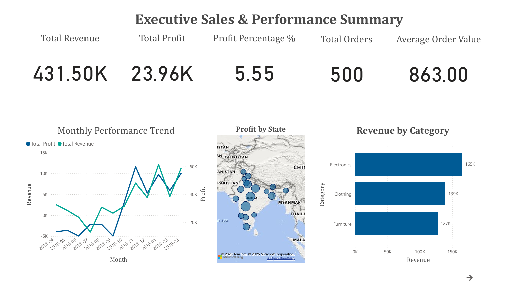
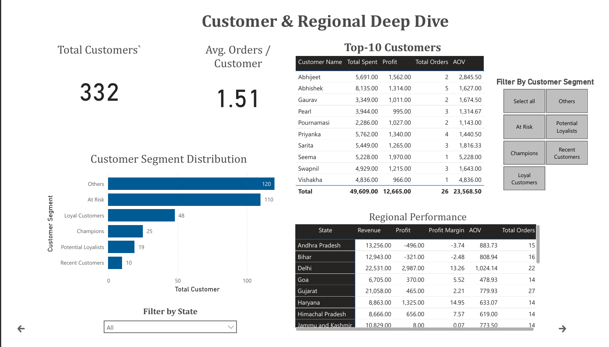
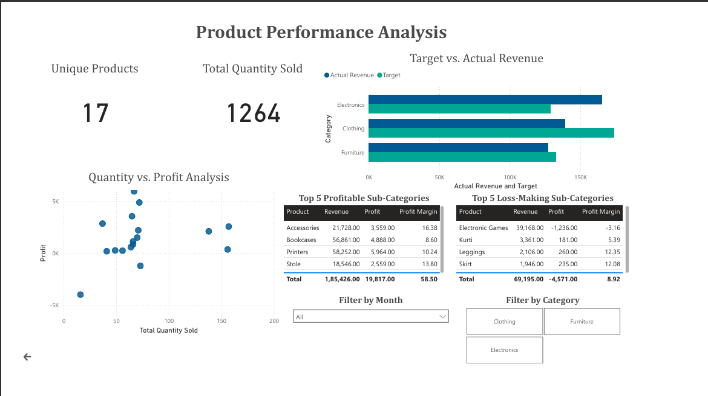

# E-commerce Sales & Performance Analysis

## 1. Project Overview

This project presents a comprehensive analysis of an Indian e-commerce dataset. The primary goal is to derive actionable insights into sales performance, customer behavior, and profitability across different regions and product categories.

The process involved setting up a PostgreSQL database, performing data modeling, and conducting in-depth analysis using SQL. The final output is a 3-page interactive dashboard built in Power BI that visualizes key performance indicators (KPIs) and provides a granular view of the business.

## 2. About the Dataset

The dataset was sourced from Kaggle and represents sales data from an Indian e-commerce platform. It contains three main files:

- **`List of Orders`**: Contains order IDs, dates, and customer details.
- **`Order Details`**: Contains line-item data for each order, including product category, amount, profit, and quantity.
- **`Sales target`**: Contains monthly sales targets for each main product category.

## 3. Technical Tools Used

- **PostgreSQL**: Used as the relational database to store, manage, and query the data. SQL was essential for complex data manipulation, aggregation, and creating views to serve as a clean data source for the BI tool.
- **Power BI**: The primary tool for data visualization and building the interactive dashboard. DAX was used for creating calculated measures (like Average Order Value) and calculated columns to enhance the data model.
- **Microsoft Excel**: Used for initial data exploration and a preliminary review of the raw CSV files.

## 4. Key Findings from SQL Analysis

- **Time-Series Analysis**: Revealed seasonal trends in orders and identified specific months with peak revenue and profit.
- **Regional Analysis**: Identified the top-performing states by revenue and profit, and also highlighted states that were high-volume but unprofitable.
- **Customer Segmentation (RFM)**: The RFM model successfully categorized customers into segments like 'Champions', 'Loyal Customers', and 'At Risk', providing a clear view of customer base health.
- **Profitability Analysis**: Uncovered the most and least profitable product categories and sub-categories, showing that high revenue does not always correlate with high profit.
- **Target vs. Actuals**: The analysis showed which product categories consistently met their monthly sales targets and which ones fell short.
- **Basket Analysis**: Identified pairs of sub-categories that are frequently purchased together, offering opportunities for cross-selling.

## 5. SQL Views Created

Seven views were created in PostgreSQL to simplify the data model for Power BI:

1.  **`kpi_overview`**: Provides a single row of high-level business metrics including total revenue, total profit, and total customers.
2.  **`monthly_performance`**: Aggregates key metrics like revenue, profit, and order count by month for time-series analysis.
3.  **`regional_performance`**: Summarizes key metrics for each state, powering map visuals and regional tables.
4.  **`customer_performance`**: Provides a detailed performance summary for each customer, including total spending and profit.
5.  **`rfm_analysis`**: Contains the complete RFM analysis output, assigning a descriptive segment to each customer.
6.  **`product_performance`**: Aggregates metrics by sub-category to analyze the performance of individual products.
7.  **`category_performance`**: Aggregates metrics by main category.
8.  **`target_analysis`**: Joins actual monthly sales with sales targets to enable variance analysis.

## 6. About the BI Dashboard

The final output is a 3-page interactive Power BI dashboard designed to provide insights to different business stakeholders. It includes slicers for interactive filtering and navigation buttons.

- **Page 1: Executive Sales & Performance Summary**: A high-level overview of the business health, including KPIs, monthly trends, and performance by region and category.
- **Page 2: Customer & Regional Deep Dive**: Focuses on customer segmentation through RFM analysis and provides a detailed breakdown of performance by state.
- **Page 3: Product Performance Analysis**: A detailed view of product performance, including a quantity-vs-profit analysis, top/bottom product tables, and target-vs-actuals tracking.

## 7. Dashboard Preview

## 8. Final Findings

- **Profitability vs. Revenue**: Electronics is the highest revenue-generating category but suffers from inconsistent profitability, while Clothing provides a more stable profit margin.
- **Customer Health**: A significant portion of the customer base is classified as 'At Risk' or 'Hibernating', indicating a need for re-engagement campaigns.
- **Geographic Disparity**: Key states like Andhra Pradesh and Bihar show high order volumes but are currently unprofitable, suggesting potential issues with logistics or local pricing strategies.
- **Product Performance**: Certain sub-categories (e.g., Bookcases, Trousers) are high-volume but consistently generate losses and require immediate pricing or sourcing review.

## 9. Conclusion & Business Suggestions

The analysis reveals that while the business shows healthy revenue, profitability is a key area for improvement, driven by specific product categories and regional operational inefficiencies.

**Business Suggestions:**

1.  **Target High-Value Customers**: Focus marketing efforts and loyalty programs on 'Champions' and 'Potential Loyalists' identified in the RFM analysis to maximize their lifetime value.
2.  **Optimize Product Pricing**: Re-evaluate the pricing and sourcing strategy for high-volume, loss-making sub-categories. Consider bundling them with high-margin products identified in the basket analysis.
3.  **Regional Strategy Review**: Investigate operational costs in unprofitable states to understand the root cause of losses despite high sales volume. Run targeted marketing campaigns in high-profit states to further boost growth.
